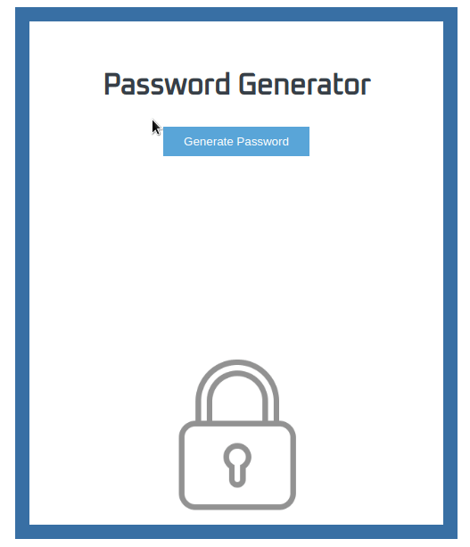

# Password Generator

Generate a random password at the click of a button.



### Release 1.0 

This project was created in Python using the Django framework. The repo is functionally complete and may be added to in the future.

### To use:

1. Clone the repository: https://github.com/ravenprocess/passgen.git
2. Install Python 3.8 : https://www.python.org/downloads/
3. Install Django 3.0 : https://docs.djangoproject.com/en/3.0/topics/install/#
4. Navigate into the main directory:
```
cd passgen/
```
5. Run the app: 
```
'python manage.py runserver'
``` 

## License

This project is licensed under the MIT License - see the [LICENSE.md](LICENSE.md) file for details
